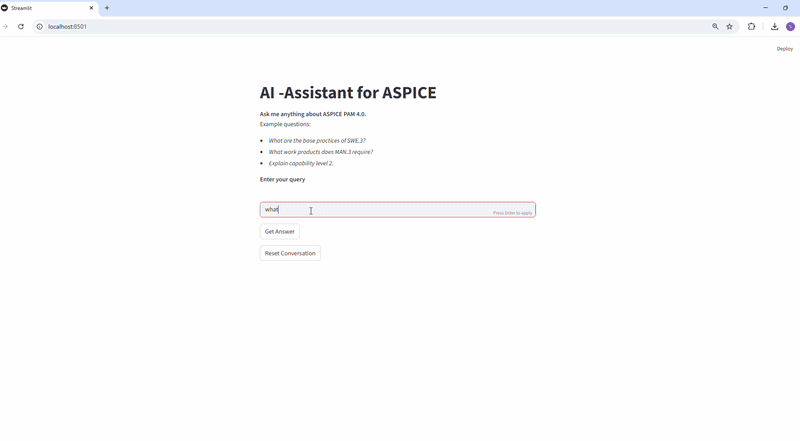
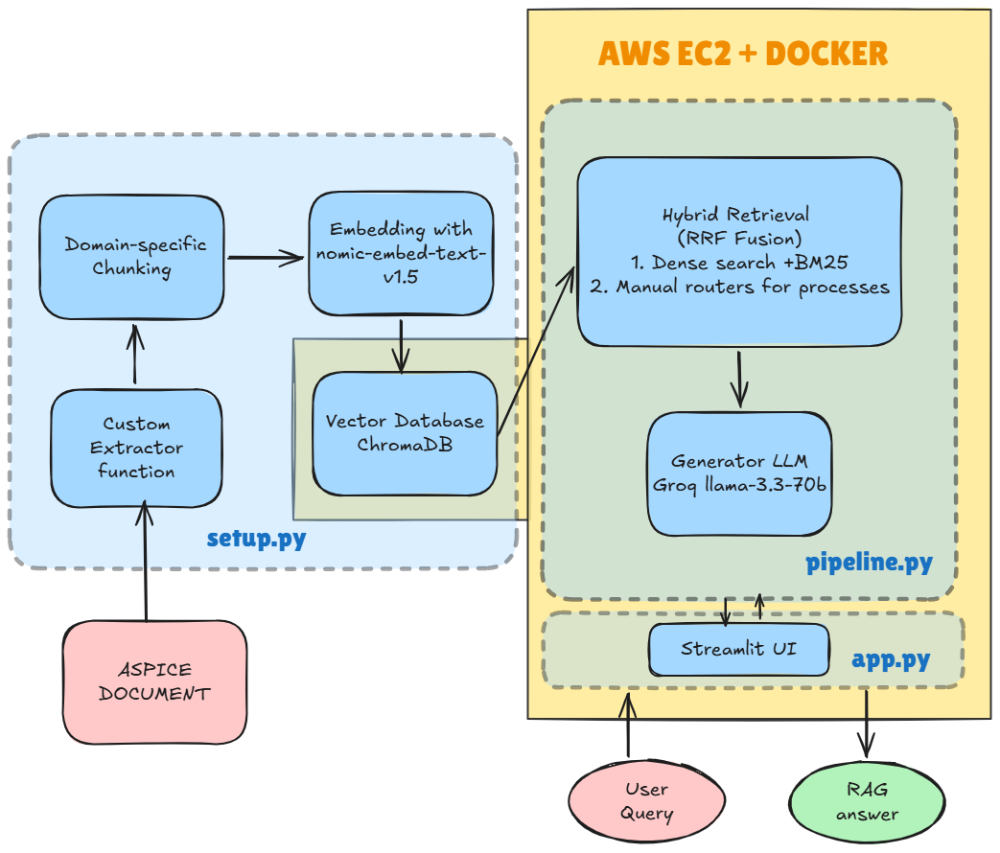

# RAG_ASPICE

RAG-powered chatbot over the ASPICE PAM 4.0 standard — a 135-page highly technical document used by automotive manufacturers including BMW, Audi, and other global OEMs to certify software and hardware compliance. Automotive engineers use this chatbot to query process requirements, work products, and base practices in natural language — instead of manually navigating dense, compact documentation. ASPICE compliance is mandatory for any software or hardware component entering a modern vehicle. Making this knowledge accessible directly improves the quality of engineering work products.

> **Live demo available on request.** Contact: [your email / LinkedIn]

---

## Demo



---

## Architecture



---

## Key Design Decisions

### 1. Domain-specific chunking over generic loaders
ASPICE PAM 4.0 contains three distinct table structures across Chapters 3, 4, and 5. LangChain's generic PDF loader flattens these into unstructured text, losing the relationship between processes, base practices, and work products. A custom `pdfplumber`-based extractor was built to parse each table type into a unified schema (`chunk_id`, `source`, `type`, `title`, `text`), producing ~44 semantically coherent chunks validated via PCA — embeddings cluster by process area, confirming domain structure is preserved.


### 2. Hybrid retrieval with process ID routing
Dense search alone misses exact process ID matches (e.g. `SWE.3`, `MAN.6`). BM25 alone lacks semantic understanding. RRF fusion combines both. A regex-based process ID router force-inserts the exact matching chunk at rank 1 when a process ID is detected in the query — a deliberate, lightweight gate that outperforms a generalised reranker for this use case.

### 3. HyDE evaluated and disabled
HyDE was implemented and tested. For general domains it improves retrieval by generating a hypothetical answer to embed instead of the raw query. For ASPICE, the LLM lacks sufficient domain grounding — generated hypothetical answers drifted from actual PAM 4.0 terminology, degrading retrieval quality. Disabled after evaluation.

### 4. No reranker
With ~44 chunks total, a cross-encoder reranker adds latency and complexity without meaningful gain. The process ID router already handles precision for the highest-value query type. Deliberate omission, not an oversight.

### 5. Groq llama-3.3-70b over OpenAI
RAG reduces dependence on LLM world knowledge — the model's job is synthesis, not recall. A 70B open-weight model via Groq's free tier performs well within this constraint, avoids OpenAI costs, and critically: the same model can be self-hosted with sufficient hardware, keeping the GDPR roadmap viable.

### 6. Local ChromaDB
No cloud vector store. ChromaDB runs as a persistent local client. No data leaves the machine during indexing or retrieval. Simple, sufficient for the chunk count, and a necessary condition for GDPR compliance.

### 7. GDPR by design
At runtime, all compute is local except the Groq API call for generation. Embeddings use `nomic-embed-text-v1.5` via sentence-transformers — fully offline. ChromaDB is local. The only external dependency is Groq. Roadmap: replace Groq with Ollama `llama3.1:8b` (locally runnable on 32GB RAM with optimised chunk size) to achieve full data sovereignty.

---

## Quickstart

### Prerequisites
- Python 3.11+
- Groq API key → get it at [console.groq.com](https://console.groq.com)
- ASPICE PAM 4.0 PDF → download from [automotivespice.com](https://automotivespice.com). Place it in: `data/raw/`

### Installation
```bash
git clone <repo>
cd RAG_ASPICE
pip install -r requirements.txt
```
### Option A: Run locally
```bash

python setup.py        # extracts, chunks, embeds, stores
streamlit run app.py   # launches UI
```

### Option B: Run with Docker
```bash
docker build -t rag_aspice .
docker run -p 8501:8501 -e GROQ_API_KEY=your_key_here rag_aspice
```

### Optional
```bash
python pipeline.py                        # terminal-based query explorer
python -m tests.test_hybrid_retriever     # run retrieval unit tests
```

---

## Evaluation

RAGAS evaluation script: `eval/ragas_eval.py`

| Metric             | Score |
|--------------------|-------|
| Context Precision  | TBD   |
| Context Recall     | TBD   |
| Faithfulness       | TBD   |

---

## Limitations & Roadmap

### Current limitations
1. **Single external dependency**: Groq API is the only non-local component. User data (queries) leave the machine at generation time.
2. **Abstract queries**: The system handles concrete process lookups well. Abstract or comparative queries ("which process is most critical?") are outside current scope. Query transformation techniques (e.g. step-back prompting) could address this.
3. **Single-turn only**: No conversational memory. Each query is independent.

### Roadmap: Full local deployment (GDPR compliant)
The architecture is designed with local inference in mind. Two viable paths:

- **Option A — Optimise chunk size**: Smaller chunks → fewer tokens per query → compatible with `llama3.1:8b` via Ollama. Tradeoff: retrieval logic becomes more complex, noise probability increases.
- **Option B — Self-host current setup**: Run `llama3.1:8b` locally on 32GB RAM. Removes Groq dependency entirely. Tradeoff: ~10-15 tokens/second on CPU — acceptable for internal tooling, not for a live demo.

---

## Tech Stack

| Component         | Tool                           |
|-------------------|--------------------------------|
| Language          | Python 3.11                    |
| PDF Extraction    | pdfplumber                     |
| Embeddings        | nomic-embed-text-v1.5          |
| Embedding Library | sentence-transformers          |
| Vector Store      | ChromaDB                       |
| Sparse Retrieval  | rank_bm25                      |
| LLM               | llama-3.3-70b-versatile (Groq) |
| UI                | Streamlit                      |
| Evaluation        | RAGAS                          |
| Containerisation  | Docker                         |
| Cloud Deployment  | AWS EC2                        |
